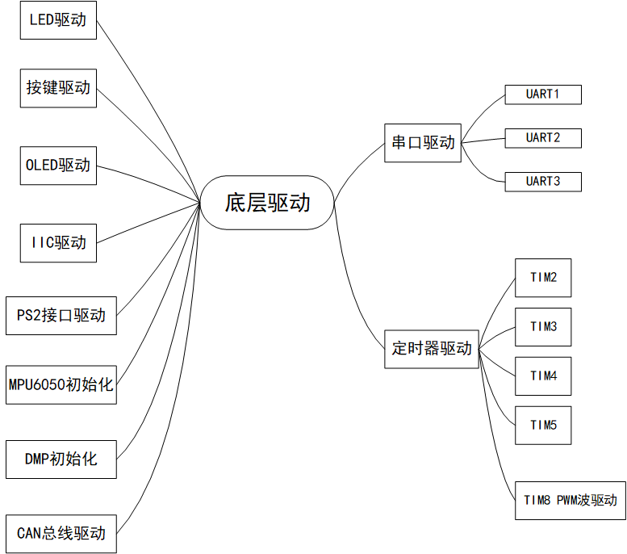

# AGV小车

## 0. 现阶段需求

最终目的为了完成工厂运输钢瓶的目的，现阶段想要实现一辆由手柄随动控制的AGV小车。

## 1. 硬件方案

### 1.1 全向轮方案

 全方位运动平台通常装有全向轮：**omni wheels（全向轮)** 或 **mecanum wheels（麦克纳姆轮)**。借助于横向移动和原地回旋的特性，全方位运动平台可方便的穿梭于狭窄拥挤空间中，灵活完成各种任务，相比传统移动平台有明显优势。 

<https://www.cnblogs.com/21207-iHome/p/7911748.html>


#### 1） 麦克纳姆轮（Mecanum Wheel）

麦克纳姆轮优点和缺点都是非常明确。采用麦克纳姆轮的车子大都移动异常灵活，机动性能非常好；但是这种轮胎的越野性能却非常差，跨越障碍的能力甚至不如普通轮胎，特别是当坡度较大的时候，甚至还会溜坡。所以配备这种车胎的设备大多是一些场地竞技机器人和室内仓储机器人等。


https://wenku.baidu.com/view/94f3c91717fc700abb68a98271fe910ef12dae8e.html?from=search
https://zhuanlan.zhihu.com/p/20282234?utm_source=qq&utm_medium=social 知乎专栏讲解
https://v.qq.com/x/page/o06206wwirk.html 直观动画演示

#### 2）全向轮（Omni Wheel）


### 1.2 机械结构方案

#### 1.2.1 机械尺寸

#### 1.2.2 载重量测试

### 1.3 电机方案

#### 1.3.1 电机选型

- MD36NP27带500线光电编码器行星减速直流有刷电机，减速比1：27


#### 1.3.2 电机驱动电路


### 1.4 测速编码器

- 减速电机自带的光电编码器，A/B相输出。

### 1.5 机械尺寸


## 2. 电控方案

### 2.1 程序流程


### 2.2 硬件驱动



#### 2.2.1 SWD调试接口

#### 2.2.2 LED指示灯

#### 2.2.3 OLED显示

#### 2.2.4 按键模式检测

#### 2.2.5 串口驱动

#### 2.2.6 编码器

硬件：***（图）***

编码器接线说明（500线AB相输出）：
红色：VCC（3.3 ~ 5V）
黑色：GND
绿色：编码器A相输出（内置电阻上拉到VCC）
白色：编码器B相输出（内置电阻上拉到VCC）

我们只需给编码器电源5V供电，在电机转动的时候即可通过AB相输出方波信号，故可判断旋转方向。编码器自带了上拉电阻，所以无需外部上拉，可以直接连接到单片机IO通过外部中断读取。比如把编码器A相输出接到单片机的外部中断输入口，这样就可以通过跳变沿触发中断，然后在对应的外部中断服务函数里面，通过B相的电平来确定正反转

初始化代码：

``` c
/**************************************************************************
函数功能：把TIM2初始化为编码器接口模式
入口参数：无
返 回 值：无
**************************************************************************/
void Encoder_Init_TIM2(void)
{
//	RCC->APB2ENR|=1<<0;    //开启辅助时钟
	AFIO->MAPR|=1<<8;      //01部分重映射
    RCC->APB1ENR|=1<<0;     //TIM2时钟使能
	RCC->APB2ENR|=1<<2;    //使能PORTA时钟
	RCC->APB2ENR|=1<<3;    //使能PORTB时钟
	GPIOA->CRH&=0X0FFFFFFF;//PA15
	GPIOA->CRH|=0X40000000;//浮空输入
	
	GPIOB->CRL&=0XFFFF0FFF;//PB3
	GPIOB->CRL|=0X00004000;//浮空输入
	TIM2->DIER|=1<<0;   //允许更新中断			
	TIM2->DIER|=1<<6;   //允许触发中断
	MY_NVIC_Init(1,3,TIM2_IRQn,1);
	TIM2->PSC = 0x0;//预分频器
	TIM2->ARR = ENCODER_TIM_PERIOD;//设定计数器自动重装值 
	TIM2->CR1 &=~(3<<8);//选择时钟分频：不分频
	TIM2->CR1 &=~(3<<5);//选择计数模式：边沿对齐模式
		
	TIM2->CCMR1 |= 1<<0; //CC1S='01' IC1FP1映射到TI1
	TIM2->CCMR1 |= 1<<8; //CC2S='01' IC2FP2映射到TI2
	TIM2->CCER &= ~(1<<1);	 //CC1P='0'	 IC1FP1不反相，IC1FP1=TI1
	TIM2->CCER &= ~(1<<5);	 //CC2P='0'	 IC2FP2不反相，IC2FP2=TI2
//	TIM2->CCMR1 |= 3<<4; //	IC1F='1000' 输入捕获1滤波器
	TIM2->SMCR |= 3<<0;	 //SMS='011' 所有的输入均在上升沿和下降沿有效
	TIM2->CR1 |= 0x01;    //CEN=1，使能定时器
}
void Encoder_Init_TIM3(void); 
void Encoder_Init_TIM4(void); 
void Encoder_Init_TIM5(void);// 四个轮子对应四个编码器
```

参数读取函数：

``` c
/**************************************************************************
函数功能：单位时间读取编码器计数
入口参数：定时器
返 回 值：速度值
**************************************************************************/
int Read_Encoder(u8 TIMX)
{
    int Encoder_TIM;    
   switch(TIMX)
	 {
	   case 2:  Encoder_TIM= (short)TIM2 -> CNT;   TIM2 -> CNT=0; break;
		 case 3:  Encoder_TIM= (short)TIM3 -> CNT;   TIM3 -> CNT=0; break;
		 case 4:  Encoder_TIM= (short)TIM4 -> CNT;   TIM4 -> CNT=0;  break;	
		 case 5:  Encoder_TIM= (short)TIM5 -> CNT;   TIM5 -> CNT=0;  break;	
		 default:  Encoder_TIM=0;
	 }
		return Encoder_TIM;
}
```

中断函数：

``` c
/**************************************************************************
函数功能：TIM2中断服务函数
入口参数：无
返 回 值：无
**************************************************************************/
void TIM2_IRQHandler(void)
{ 		    		  			    
	if(TIM2->SR&0X0001)//溢出中断
	{    				   				     	    	
	}				   
	TIM2->SR&=~(1<<0);//清除中断标志位	    
}
void TIM3_IRQHandler(void); 
void TIM4_IRQHandler(void); 
void TIM5_IRQHandler(void);
```

#### 2.2.7 AD/DA

#### 2.2.8 MPU6050/DMP

#### 2.2.9 电机

本车电机采用行星减速机，其优点是结构比较紧凑，回程间隙小、精度较高，使用寿命很长，额定输出扭矩可以做的很大，但价格略贵。

电机本身可直接通过调整电机两极的直流电压大小和极性实现调试和换向，但单片机IO的带负载能力较弱，而直流电机是大电流感性负载，所以我们需要功率放大器件。

***（功率放大模块）***

电机初始化代码：

``` c
 /**************************************************************************
函数功能：电机控制所需IO初始化
入口参数：无
返 回 值：无
**************************************************************************/
void MiniBalance_Motor_Init(void)
{
	RCC->APB2ENR|=1<<3;       //PORTB时钟使能  
	RCC->APB2ENR|=1<<4;       //PORTC时钟使能 
	GPIOB->CRL&=0XFFFFFF00;   //推挽输出
	GPIOB->CRL|=0X00000022;   //推挽输出
	//GPIOB->ODR|=0<<0;  	
	//GPIOB->ODR|=0<<1;  	
	
	GPIOC->CRL&=0XFF00FFFF;   //推挽输出
	GPIOC->CRL|=0X00220000;   //推挽输出
	//GPIOC->ODR|=0<<4;
	//GPIOC->ODR|=0<<5; 
```

PWM输出初始化代码：

``` c
 /**************************************************************************
函数功能：PWM波输出初始化
入口参数：自动重装载值、预分频系数
返 回 值：无
**************************************************************************/
void MiniBalance_PWM_Init(u16 arr,u16 psc)
{		 					 
	MiniBalance_Motor_Init();  //初始化电机控制所需IO
	RCC->APB2ENR|=1<<13;       //使能TIM8时钟  
	RCC->APB2ENR|=1<<4;        //PORTC时钟使能    
	GPIOC->CRH&=0XFFFFFF00;    //PORTC8复用输出
	GPIOC->CRH|=0X000000BB;    //PORTC8复用输出
	
	GPIOC->CRL&=0X00FFFFFF;    //PORTC6 7复用输出
	GPIOC->CRL|=0XBB000000;    //PORTC6 7复用输出
	TIM8->ARR=arr;             //设定计数器自动重装值
	TIM8->PSC=psc;             //设定预分频器系数
	TIM8->CCMR1|=6<<4;         //CH1 PWM1模式	
	TIM8->CCMR1|=6<<12;        //CH2 PWM1模式	
	TIM8->CCMR2|=6<<4;         //CH3 PWM1模式	
	TIM8->CCMR2|=6<<12;        //CH4 PWM1模式	
	
	TIM8->CCMR1|=1<<3;         //CH1预装载使能  
	TIM8->CCMR1|=1<<11;        //CH2预装载使能
	TIM8->CCMR2|=1<<3;         //CH3预装载使能
	TIM8->CCMR2|=1<<11;        //CH4预装载使能
	
	TIM8->CCER|=1<<0;         //CH1输出使能
	TIM8->CCER|=1<<4;         //CH2输出使能   
	TIM8->CCER|=1<<8;         //CH3输出使能
	TIM8->CCER|=1<<12;        //CH4输出使能
	TIM8->BDTR |= 1<<15;       //TIM必须要这句话才能输出PWM, main output enable 
	TIM8->CR1=0x8000;          //ARPE使能
	//stm32chinese p233 -->TIM8->CR1=0x0080??
	TIM8->CR1|=0x01;          //使能定时器1			
} 
```


#### 2.2.10 flash读写

#### 2.2.11 PS2手柄驱动

#### 2.2.12 CAN通信

### 2.3 控制算法