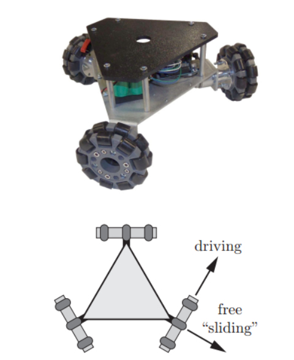
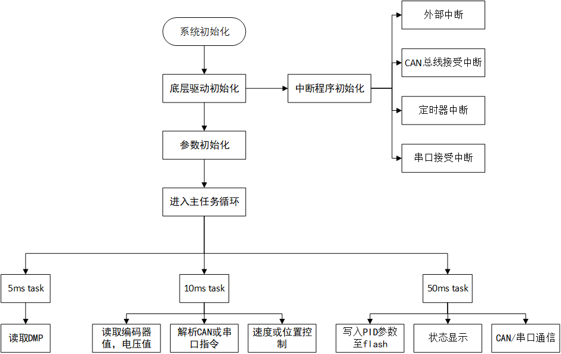
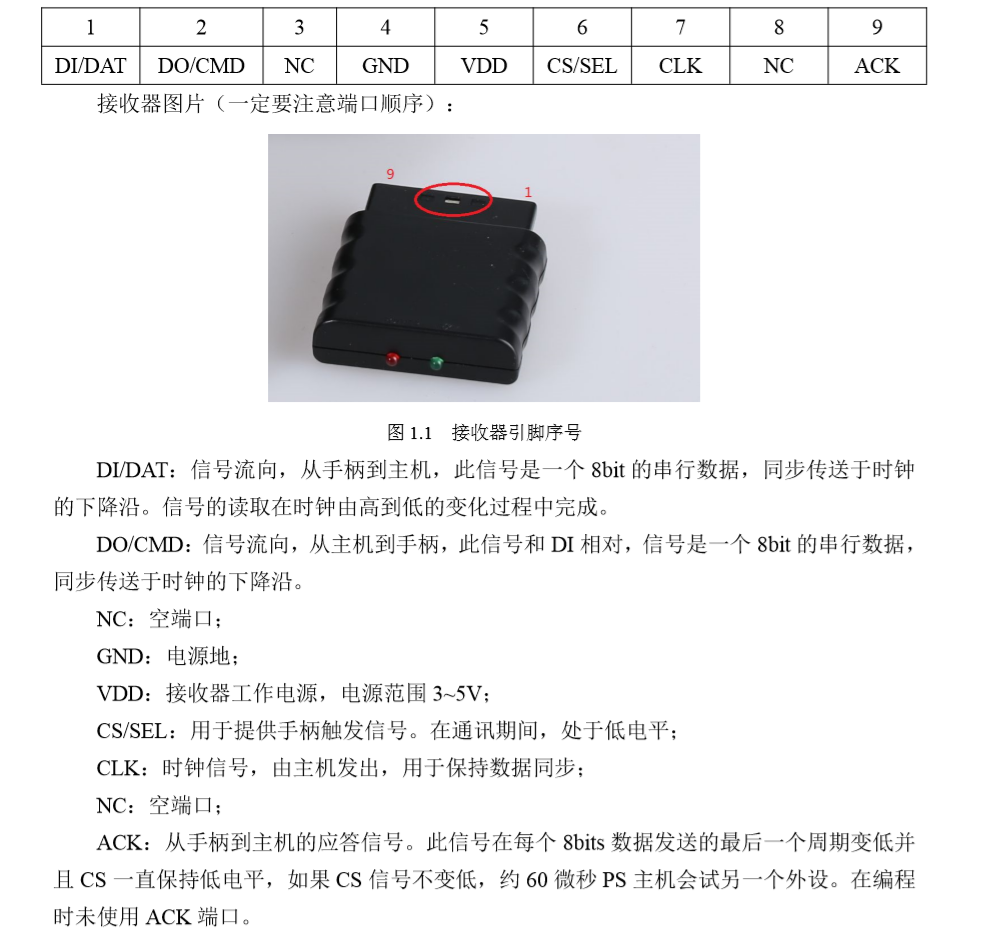
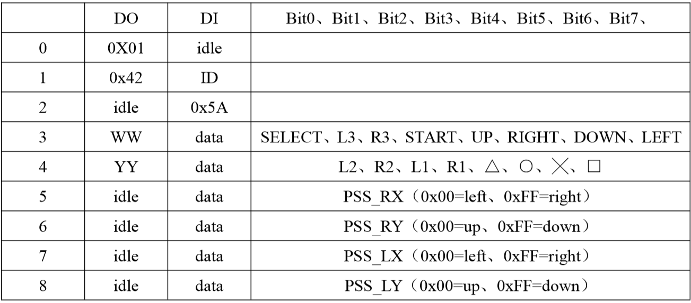
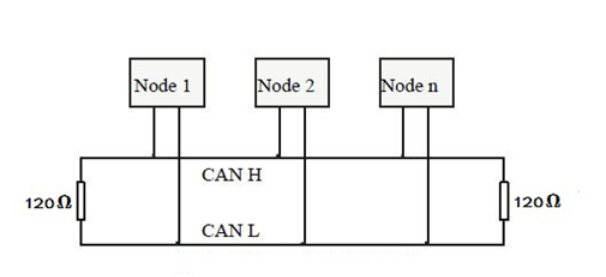
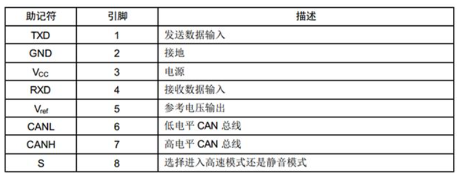
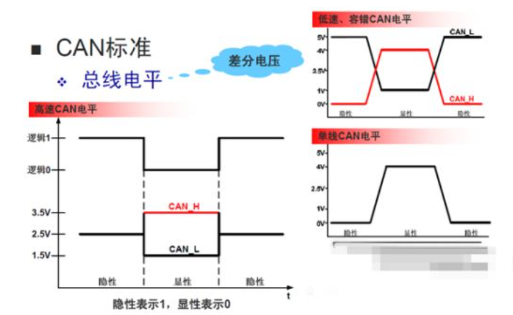
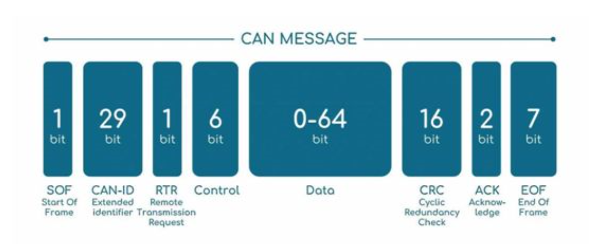
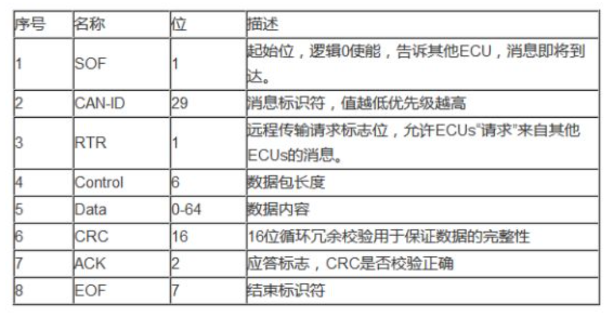

# AGV小车

## 0. 现阶段需求

最终目的为了完成工厂运输钢瓶的目的，现阶段想要实现一辆由手柄随动控制的AGV小车。

## 1. 硬件方案

### 1.1 全向轮方案

 全方位运动平台通常装有全向轮：**omni wheels（全向轮)** 或 **mecanum wheels（麦克纳姆轮)**。借助于横向移动和原地回旋的特性，全方位运动平台可方便的穿梭于狭窄拥挤空间中，灵活完成各种任务，相比传统移动平台有明显优势。 

<https://www.cnblogs.com/21207-iHome/p/7911748.html>


#### 1） 麦克纳姆轮（Mecanum Wheel）

麦克纳姆轮优点和缺点都是非常明确。采用麦克纳姆轮的车子大都移动异常灵活，机动性能非常好；但是这种轮胎的越野性能却非常差，跨越障碍的能力甚至不如普通轮胎，特别是当坡度较大的时候，甚至还会溜坡。所以配备这种车胎的设备大多是一些场地竞技机器人和室内仓储机器人等。


https://wenku.baidu.com/view/94f3c91717fc700abb68a98271fe910ef12dae8e.html?from=search
https://zhuanlan.zhihu.com/p/20282234?utm_source=qq&utm_medium=social 知乎专栏讲解
https://v.qq.com/x/page/o06206wwirk.html 直观动画演示

#### 2）全向轮（Omni Wheel）



### 1.2 机械结构方案

#### 1.2.1 全车机械尺寸

#### 1.2.2 载重量测试

### 1.3 电机方案

#### 1.3.1 电机选型

- MD36NP27带500线光电编码器行星减速直流有刷电机，减速比1：27


#### 1.3.2 电机驱动电路


### 1.4 测速编码器

- 减速电机自带的光电编码器，A/B相输出。

### 1.5 电机机械尺寸


## 2. 电控方案

### 2.1 程序流程



### 2.2 硬件驱动


#### 2.2.1 SWD调试接口

#### 2.2.2 LED指示灯

#### 2.2.3 OLED显示

#### 2.2.4 按键模式检测

#### 2.2.5 串口驱动

#### 2.2.6 编码器

编码器接线说明（500线AB相输出）：
红色：VCC（3.3 ~ 5V）
黑色：GND
绿色：编码器A相输出（内置电阻上拉到VCC）
白色：编码器B相输出（内置电阻上拉到VCC）

我们只需给编码器电源5V供电，在电机转动的时候即可通过AB相输出方波信号，故可判断旋转方向。编码器自带了上拉电阻，所以无需外部上拉，可以直接连接到单片机IO通过外部中断读取。比如把编码器A相输出接到单片机的外部中断输入口，这样就可以通过跳变沿触发中断，然后在对应的外部中断服务函数里面，通过B相的电平来确定正反转

初始化代码：

``` c
/**************************************************************************
函数功能：把TIM2初始化为编码器接口模式
入口参数：无
返 回 值：无
**************************************************************************/
void Encoder_Init_TIM2(void)
{
//	RCC->APB2ENR|=1<<0;    //开启辅助时钟
    AFIO->MAPR|=1<<8;      //01部分重映射
    RCC->APB1ENR|=1<<0;     //TIM2时钟使能
    RCC->APB2ENR|=1<<2;    //使能PORTA时钟
    RCC->APB2ENR|=1<<3;    //使能PORTB时钟
    GPIOA->CRH&=0X0FFFFFFF;//PA15
    GPIOA->CRH|=0X40000000;//浮空输入
    
    GPIOB->CRL&=0XFFFF0FFF;//PB3
    GPIOB->CRL|=0X00004000;//浮空输入
    TIM2->DIER|=1<<0;   //允许更新中断
    TIM2->DIER|=1<<6;   //允许触发中断
    MY_NVIC_Init(1,3,TIM2_IRQn,1);
    TIM2->PSC = 0x0;//预分频器
    TIM2->ARR = ENCODER_TIM_PERIOD;//设定计数器自动重装值 
    TIM2->CR1 &=~(3<<8);//选择时钟分频：不分频
    TIM2->CR1 &=~(3<<5);//选择计数模式：边沿对齐模式
        
    TIM2->CCMR1 |= 1<<0; //CC1S='01' IC1FP1映射到TI1
    TIM2->CCMR1 |= 1<<8; //CC2S='01' IC2FP2映射到TI2
    TIM2->CCER &= ~(1<<1);	 //CC1P='0'	 IC1FP1不反相，IC1FP1=TI1
    TIM2->CCER &= ~(1<<5);	 //CC2P='0'	 IC2FP2不反相，IC2FP2=TI2
//	TIM2->CCMR1 |= 3<<4; //	IC1F='1000' 输入捕获1滤波器
    TIM2->SMCR |= 3<<0;	 //SMS='011' 所有的输入均在上升沿和下降沿有效
    TIM2->CR1 |= 0x01;    //CEN=1，使能定时器
}
void Encoder_Init_TIM3(void); 
void Encoder_Init_TIM4(void); 
void Encoder_Init_TIM5(void);// 四个轮子对应四个编码器
```

参数读取函数：

``` c
/**************************************************************************
函数功能：单位时间读取编码器计数
入口参数：定时器
返 回 值：速度值
**************************************************************************/
int Read_Encoder(u8 TIMX)
{
    int Encoder_TIM;
    switch(TIMX)
    {
        case 2:  Encoder_TIM= (short)TIM2 -> CNT;   TIM2 -> CNT=0; break;
        case 3:  Encoder_TIM= (short)TIM3 -> CNT;   TIM3 -> CNT=0; break;
        case 4:  Encoder_TIM= (short)TIM4 -> CNT;   TIM4 -> CNT=0;  break;	
        case 5:  Encoder_TIM= (short)TIM5 -> CNT;   TIM5 -> CNT=0;  break;	
        default:  Encoder_TIM=0;
    }
    return Encoder_TIM;
}
```

中断函数：

``` c
/**************************************************************************
函数功能：TIM2中断服务函数
入口参数：无
返 回 值：无
**************************************************************************/
void TIM2_IRQHandler(void)
{
    if(TIM2->SR&0X0001)//溢出中断
    {
    }				   
    TIM2->SR&=~(1<<0);//清除中断标志位	    
}
void TIM3_IRQHandler(void); 
void TIM4_IRQHandler(void); 
void TIM5_IRQHandler(void);
```

#### 2.2.7 AD/DA

#### 2.2.8 MPU6050/DMP

#### 2.2.9 电机

本车电机采用行星减速机，其优点是结构比较紧凑，回程间隙小、精度较高，使用寿命很长，额定输出扭矩可以做的很大，但价格略贵。

电机本身可直接通过调整电机两极的直流电压大小和极性实现调试和换向，但单片机IO的带负载能力较弱，而直流电机是大电流感性负载，所以我们需要功率放大器件。

电机初始化代码：

``` c
 /**************************************************************************
函数功能：电机控制所需IO初始化
入口参数：无
返 回 值：无
**************************************************************************/
void MiniBalance_Motor_Init(void)
{
    RCC->APB2ENR|=1<<3;       //PORTB时钟使能  
    RCC->APB2ENR|=1<<4;       //PORTC时钟使能 
    GPIOB->CRL&=0XFFFFFF00;   //推挽输出
    GPIOB->CRL|=0X00000022;   //推挽输出
    //GPIOB->ODR|=0<<0;
    //GPIOB->ODR|=0<<1;

    GPIOC->CRL&=0XFF00FFFF;   //推挽输出
    GPIOC->CRL|=0X00220000;   //推挽输出
    //GPIOC->ODR|=0<<4;
    //GPIOC->ODR|=0<<5;
```

PWM输出初始化代码：

``` c
 /**************************************************************************
函数功能：PWM波输出初始化
入口参数：自动重装载值、预分频系数
返 回 值：无
**************************************************************************/
void MiniBalance_PWM_Init(u16 arr,u16 psc)
{		 					 
    MiniBalance_Motor_Init();  //初始化电机控制所需IO
    RCC->APB2ENR|=1<<13;       //使能TIM8时钟  
    RCC->APB2ENR|=1<<4;        //PORTC时钟使能    
    GPIOC->CRH&=0XFFFFFF00;    //PORTC8复用输出
    GPIOC->CRH|=0X000000BB;    //PORTC8复用输出
    
    GPIOC->CRL&=0X00FFFFFF;    //PORTC6 7复用输出
    GPIOC->CRL|=0XBB000000;    //PORTC6 7复用输出
    TIM8->ARR=arr;             //设定计数器自动重装值
    TIM8->PSC=psc;             //设定预分频器系数
    TIM8->CCMR1|=6<<4;         //CH1 PWM1模式	
    TIM8->CCMR1|=6<<12;        //CH2 PWM1模式	
    TIM8->CCMR2|=6<<4;         //CH3 PWM1模式	
    TIM8->CCMR2|=6<<12;        //CH4 PWM1模式	
    
    TIM8->CCMR1|=1<<3;         //CH1预装载使能  
    TIM8->CCMR1|=1<<11;        //CH2预装载使能
    TIM8->CCMR2|=1<<3;         //CH3预装载使能
    TIM8->CCMR2|=1<<11;        //CH4预装载使能
    
    TIM8->CCER|=1<<0;         //CH1输出使能
    TIM8->CCER|=1<<4;         //CH2输出使能   
    TIM8->CCER|=1<<8;         //CH3输出使能
    TIM8->CCER|=1<<12;        //CH4输出使能
    TIM8->BDTR |= 1<<15;       //TIM必须要这句话才能输出PWM, main output enable 
    TIM8->CR1=0x8000;          //ARPE使能
    //stm32chinese p233 -->TIM8->CR1=0x0080??
    TIM8->CR1|=0x01;          //使能定时器1			
} 
```


#### 2.2.10 flash读写

#### 2.2.11 PS2手柄驱动

##### 2.2.11.1 引脚定义

* PS2分为手柄和接收头两个部分，接收头引脚序号如下图所示：



 ##### 2.2.11.2 通讯时序


##### 2.2.11.3 通信协议



* 当有按键按下时，对应位为0， 其他位为1， 例如当键 SELECT 被按下时，Data【3】= 11111110B。

  在设置了震动模式后，就可以通过发送WW，YY 来控制震动电机。WW控制右侧的小震动电机，0x00关，其他值为开；YY用来控制左侧的大震动电机，0x40~0xFF电机开，值越大电机转动越快，震动越明显。

  * 红灯模式时：左右摇杆发送模拟值，0x40~0xFF之间，且摇杆按下的键值L3、R3有效；

  * 绿灯模式时：左右摇杆模拟值无效，推到极限时，对应发送UP、RIGHT，DOWN，LEFT，▲，⚪，×，口，按键L3，R3 无效。

##### 2.2.11.4 手柄的使用、连接与配对

* PS2手柄使用两节7号1.5V的电池供电，接收器和单片机共用一个电源，电压范围为3-5V，过压和接反都会使接收器烧坏。
* 手柄上有电源开关，ON开/OFF关，将手柄开关打到ON上，在未搜索到接收器的状况下，手柄的灯会不停的闪，在一定时间内还未搜索到接收器，手柄将进入待机状态，手柄的灯将灭掉。此时，只有通过START键，唤醒手柄。
* 接收器供电后，在未配对的情况下，绿灯闪。
* 手柄打开，接收器供电的情况下，手柄和接收器会自动配对，这时红绿灯常亮，手柄配对成功。按键MODE/ANALOG 可以选择红灯模式，绿灯模式。

##### 2.2.11.5 手柄及接收头详细介绍

[2.4G无线手柄IC](www.bmchip.com/te_product_mis/2012-08-20/2011.chtml)

[2.4G无线手柄 接收](http://www.bmchip.com/te_product_mis/2012-08-20/2010.chtml)

接收器以软件模拟IIC的方式将手柄发来的数据传递给主机。

##### 2.2.11.6 PS2手柄控制代码

PS2手柄初始化代码：

```C
/********************************************************
函数功能：手柄接口初始化
入口参数：无
返回值：无
*********************************************************/
void PS2_Init(void)
{
    RCC->APB2ENR|=1<<2;     //使能PORTA时钟
    GPIOA->CRL&=0XFFFF000F; //PA1 2 3推挽输出   
    GPIOA->CRL|=0X00003330;   

    GPIOA->CRL&=0XFFFFFFF0; 
    GPIOA->CRL|=0X00000008;//PA0 设置成输入	默认下拉   	 	 											  
}

```

主机向手柄发送命令：

```C
/************************************************************
函数功能：主机向手柄发送命令
入口参数：
    CMD：命令数组
返回值：无
************************************************************/
void PS2_Cmd(u8 CMD)
{
    volatile u16 ref=0x01;
    Data[1] = 0;
    for(ref=0x01;ref<0x0100;ref<<=1)
    {
        if(ref&CMD)
        {
            DO_H;                   //输出一位控制位
        }
        else DO_L;

        CLK_H;                        //时钟拉高
        DELAY_TIME;
        CLK_L;
        DELAY_TIME;
        CLK_H;
        if(DI)
            Data[1] = ref|Data[1];
    }
    delay_us(16);
}
```

主机读取手柄数据：

```C
/*********************************************************************
函数功能：读取手柄数据
入口参数：无
返回值：无
void PS2_ReadData(void)
{
    volatile u8 byte=0;
    volatile u16 ref=0x01;
    CS_L;
    PS2_Cmd(Comd[0]);  //开始命令
    PS2_Cmd(Comd[1]);  //请求数据
    for(byte=2;byte<9;byte++)          //开始接受数据
    {
        for(ref=0x01;ref<0x100;ref<<=1)
        {
            CLK_H;
            DELAY_TIME;
            CLK_L;
            DELAY_TIME;
            CLK_H;
              if(DI)
              Data[byte] = ref|Data[byte];
        }
        delay_us(16);
    }
    CS_H;
}

```


#### 2.2.12 CAN通信

##### 2.2.12.1 CAN总线结构

##### 

* CAN总线网络主要挂在CAN_H和CAN_L，各个节点通过这两条线实现信号的串行差分传输，为了避免信号的反射和干扰，还需要在CAN_H和CAN_L之间接上120欧姆的终端电阻

##### 2.2.12.2 CAN收发器


* 小车所用芯片STM32F103RCT6自带一个CAN收发器。CAN收发器的作用是负责逻辑电平和信号电平之间的转换。即从CAN控制芯片输出逻辑电平到CAN收发器，然后经过CAN收发器内部转换将逻辑电平转换为差分信号输出到CAN总线上，CAN总线上的节点都可以决定自己是否需要总线上的数据。具体的管教定义如下：



##### 2.2.12.3 CAN信号表示

* CAN总线采用不归零码位填充技术，也就是说CAN总线上的信号有两种不同的信号状态，分别是显性的(Dominant)逻辑0和隐形的(recessive)逻辑1，信号每一次传输完后不需要返回到逻辑0(显性)的电平。

  

  CAN收发器有TXD，RXD是与CAN控制器连接的。发送器接到网络的是CL和CH。CL与CH是差分电路。CAN网络上是用CL于CH的电压差来表示逻辑“0”和逻辑“1”。所以CAN网络中只能单向传输。

  ##### 2.2.12.4 CAN总线通信协议

  

  

  


##### 2.2.12.5 CAN控制代码

CAN控制器初始化：

```c
/********************************************************
函数功能：CAN1初始化
入口参数：
    tsjw:重新同步跳跃时间单元.范围:1~3;
    tbs2:时间段2的时间单元.范围:1~8;
    tbs1:时间段1的时间单元.范围:1~16;
    brp :波特率分频器.范围:1~1024;(实际要加1,也就是1~1024) tq=(brp)*tpclk1
        注意以上参数任何一个都不能设为0,否则会乱.
        波特率=Fpclk1/((tbs1+tbs2+1)*brp);
    mode:0,普通模式;1,回环模式;
        Fpclk1的时钟在初始化的时候设置为36M,如果设置CAN1_Normal_Init(1,2,3,12,1);
        则波特率为:   36/(1+3+2)/12=500K * 
返回值:0,初始化OK;
    其他,初始化失败;
********************************************************/
u8 CAN1_Mode_Init(u8 tsjw,u8 tbs2,u8 tbs1,u16 brp,u8 mode)
{
    u16 i=0;
     if(tsjw==0||tbs2==0||tbs1==0||brp==0)return 1;
    tsjw-=1;//先减去1.再用于设置
    tbs2-=1;
    tbs1-=1;
    brp-=1;

    RCC->APB2ENR|=1<<2;    //使能PORTA时钟	 
    GPIOA->CRH&=0XFFF00FFF; 
    GPIOA->CRH|=0X000B8000;//PA11 RX,PA12 TX推挽输出   	 
    GPIOA->ODR|=3<<11;
                        
    RCC->APB1ENR|=1<<25;//使能CAN1时钟 CAN1使用的是APB1的时钟(max:36M)
    CAN1->MCR=0x0000;	//退出睡眠模式(同时设置所有位为0)
    CAN1->MCR|=1<<0;		//请求CAN1进入初始化模式
    while((CAN1->MSR&1<<0)==0)
    {
        i++;
        if(i>100)return 2;//进入初始化模式失败
    }
    CAN1->MCR|=0<<7;		//非时间触发通信模式
    CAN1->MCR|=0<<6;		//软件自动离线管理
    CAN1->MCR|=0<<5;		//睡眠模式通过软件唤醒(清除CAN1->MCR的SLEEP位)
    CAN1->MCR|=1<<4;		//禁止报文自动传送
    CAN1->MCR|=0<<3;		//报文不锁定,新的覆盖旧的
    CAN1->MCR|=0<<2;		//优先级由报文标识符决定
    CAN1->BTR=0x00000000;//清除原来的设置.
    CAN1->BTR|=mode<<30;	//模式设置 0,普通模式;1,回环模式;
    CAN1->BTR|=tsjw<<24; //重新同步跳跃宽度(Tsjw)为tsjw+1个时间单位
    CAN1->BTR|=tbs2<<20; //Tbs2=tbs2+1个时间单位
    CAN1->BTR|=tbs1<<16;	//Tbs1=tbs1+1个时间单位
    CAN1->BTR|=brp<<0;  	//分频系数(Fdiv)为brp+1
                        //波特率:Fpclk1/((Tbs1+Tbs2+1)*Fdiv)
    CAN1->MCR&=~(1<<0);	//请求CAN1退出初始化模式
    while((CAN1->MSR&1<<0)==1)
    {
        i++;
        if(i>0XFFF0)return 3;//退出初始化模式失败
    }
    //过滤器初始化
    CAN1->FMR|=1<<0;			//过滤器组工作在初始化模式
    CAN1->FA1R&=~(1<<0);		//过滤器0不激活
    CAN1->FS1R|=1<<0; 		//过滤器位宽为32位.
    CAN1->FM1R|=0<<0;		//过滤器0工作在标识符屏蔽位模式
    CAN1->FFA1R|=0<<0;		//过滤器0关联到FIFO0
    CAN1->sFilterRegister[0].FR1=0X00000000;//32位ID
    CAN1->sFilterRegister[0].FR2=0X00000000;//32位MASK
    CAN1->FA1R|=1<<0;		//激活过滤器0
    CAN1->FMR&=0<<0;			//过滤器组进入正常模式

#if CAN1_RX0_INT_ENABLE
     //使用中断接收
    CAN1->IER|=1<<1;			//FIFO0消息挂号中断允许.	    
    MY_NVIC_Init(1,0,USB_LP_CAN1_RX0_IRQn,2);//组2
#endif
    return 0;
}  
```

CAN 发送数据：

```C
/****************************************************************
函数功能：通过CAN发送数据
输入参数：
    id:标准ID(11位)/扩展ID(11位+18位)	    
    ide:0,标准帧;1,扩展帧
    rtr:0,数据帧;1,远程帧
    len:要发送的数据长度(固定为8个字节,在时间触发模式下,有效数据为6个字节)
    *dat:数据指针.
返回值:0~3,邮箱编号.0XFF,无有效邮箱.
******************************************************************/
u8 CAN1_Tx_Msg(u32 id,u8 ide,u8 rtr,u8 len,u8 *dat)
{	   
    u8 mbox;	  
    if(CAN1->TSR&(1<<26))mbox=0;			//邮箱0为空
    else if(CAN1->TSR&(1<<27))mbox=1;	//邮箱1为空
    else if(CAN1->TSR&(1<<28))mbox=2;	//邮箱2为空
    else return 0XFF;					//无空邮箱,无法发送 
    CAN1->sTxMailBox[mbox].TIR=0;		//清除之前的设置
    if(ide==0)	//标准帧
    {
        id&=0x7ff;//取低11位stdid
        id<<=21;		  
    }else		//扩展帧
    {
        id&=0X1FFFFFFF;//取低32位extid
        id<<=3;									   
    }
    CAN1->sTxMailBox[mbox].TIR|=id;		 
    CAN1->sTxMailBox[mbox].TIR|=ide<<2;	  
    CAN1->sTxMailBox[mbox].TIR|=rtr<<1;
    len&=0X0F;//得到低四位
    CAN1->sTxMailBox[mbox].TDTR&=~(0X0000000F);
    CAN1->sTxMailBox[mbox].TDTR|=len;		   //设置DLC.
    //待发送数据存入邮箱.
    CAN1->sTxMailBox[mbox].TDHR=(((u32)dat[7]<<24)|
                                ((u32)dat[6]<<16)|
                                 ((u32)dat[5]<<8)|
                                ((u32)dat[4]));
    CAN1->sTxMailBox[mbox].TDLR=(((u32)dat[3]<<24)|
                                ((u32)dat[2]<<16)|
                                 ((u32)dat[1]<<8)|
                                ((u32)dat[0]));
    CAN1->sTxMailBox[mbox].TIR|=1<<0; //请求发送邮箱数据
    return mbox;
}
```

CAN接收数据：

```C
/***************************************************************
函数功能：通过CAN接收数据
输入参数：
    fifox:邮箱号
    id:标准ID(11位)/扩展ID(11位+18位)	    
    ide:0,标准帧;1,扩展帧
    rtr:0,数据帧;1,远程帧
    len:接收到的数据长度(固定为8个字节,在时间触发模式下,有效数据为6个字节)
    dat:数据缓存区
*****************************************************************/
void CAN1_Rx_Msg(u8 fifox,u32 *id,u8 *ide,u8 *rtr,u8 *len,u8 *dat)
{	   
    *ide=CAN1->sFIFOMailBox[fifox].RIR&0x04;//得到标识符选择位的值  
     if(*ide==0)//标准标识符
    {
        *id=CAN1->sFIFOMailBox[fifox].RIR>>21;
    }else	   //扩展标识符
    {
        *id=CAN1->sFIFOMailBox[fifox].RIR>>3;
    }
    *rtr=CAN1->sFIFOMailBox[fifox].RIR&0x02;	//得到远程发送请求值.
    *len=CAN1->sFIFOMailBox[fifox].RDTR&0x0F;//得到DLC
     //*fmi=(CAN1->sFIFOMailBox[FIFONumber].RDTR>>8)&0xFF;//得到FMI
    //接收数据
    dat[0]=CAN1->sFIFOMailBox[fifox].RDLR&0XFF;
    dat[1]=(CAN1->sFIFOMailBox[fifox].RDLR>>8)&0XFF;
    dat[2]=(CAN1->sFIFOMailBox[fifox].RDLR>>16)&0XFF;
    dat[3]=(CAN1->sFIFOMailBox[fifox].RDLR>>24)&0XFF;    
    dat[4]=CAN1->sFIFOMailBox[fifox].RDHR&0XFF;
    dat[5]=(CAN1->sFIFOMailBox[fifox].RDHR>>8)&0XFF;
    dat[6]=(CAN1->sFIFOMailBox[fifox].RDHR>>16)&0XFF;
    dat[7]=(CAN1->sFIFOMailBox[fifox].RDHR>>24)&0XFF;    
      if(fifox==0)CAN1->RF0R|=0X20;//释放FIFO0邮箱
    else if(fifox==1)CAN1->RF1R|=0X20;//释放FIFO1邮箱	 
}

```

中断服务函数：

```C
#if CAN1_RX0_INT_ENABLE	//使能RX0中断
//中断服务函数			    
void USB_LP_CAN1_RX0_IRQHandler(void)
{
  u8 i;
    u32 id;
    u8 ide,rtr,len;     
     CAN1_Rx_Msg(0,&id,&ide,&rtr,&len,rxbuf);
  if(id==0x100)
    {	
        for(i=0;i<8;i++)
        {
        Rxbuf[i]=rxbuf[i];
        }
  }
     else if(id==0x101)
    {	
        for(i=8;i<16;i++)
        {
        Rxbuf[i]=rxbuf[i-8];
        }
  }

}
#endif

```


### 2.3 控制算法